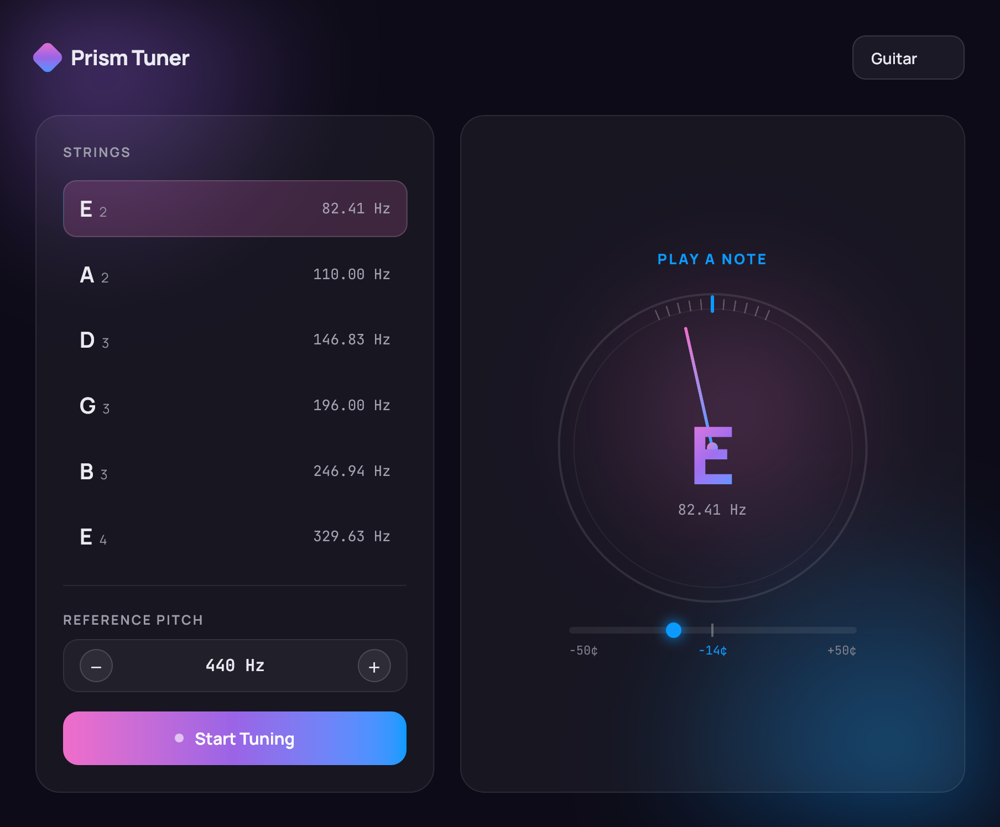
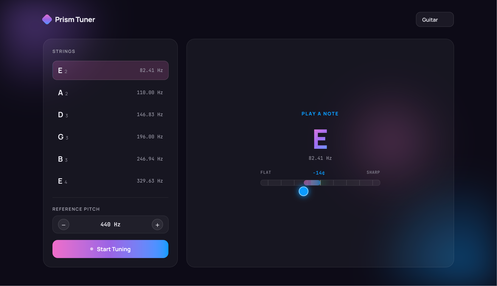
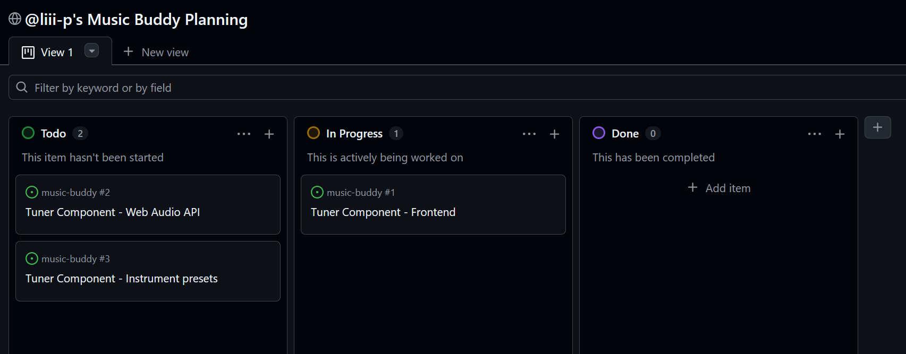

<a id="readme-top"></a>

[![Contributors][contributors-shield]][contributors-url]
[![Forks][forks-shield]][forks-url]
[![Stargazers][stars-shield]][stars-url]
[![Issues][issues-shield]][issues-url]
[![project_license][license-shield]][license-url]
[![LinkedIn][linkedin-shield]][linkedin-url]

<h3 align="center">Music Buddy</h3>

  <p align="center">
    An all-in-one music buddy for musicians of any stage. Includes a tuner, a routine tracker and the option to receive personalised routine suggestions via AI.
    <br />
    <a href="https://github.com/liii-p/music-buddy"><strong>Explore the docs »</strong></a>
    <br />
    <br />
    <a href="https://github.com/github_username/repo_name">View Demo</a>
    &middot;
    <a href="https://github.com/liii-p/music-buddy/issues/new?labels=bug&template=bug-report---.md">Report Bug</a>
    &middot;
    <a href="https://github.com/liii-p/music-buddy/new?labels=enhancement&template=feature-request---.md">Request Feature</a>
  </p>
</div>

<!-- TABLE OF CONTENTS -->
<details>
  <summary>Table of Contents</summary>
  <ol>
    <li>
      <a href="#about-the-project">About The Project</a>
      <ul>
        <li><a href="#built-with">Built With</a></li>
      </ul>
    </li>
    <li>
      <a href="#getting-started">Getting Started</a>
      <ul>
        <li><a href="#prerequisites">Prerequisites</a></li>
        <li><a href="#installation">Installation</a></li>
      </ul>
    </li>
    <li><a href="#usage">Usage</a></li>
    <li><a href="#roadmap">Roadmap</a></li>
  </ol>
</details>

<!-- ABOUT THE PROJECT -->

## About The Project

<!-- [![Product Name Screen Shot][product-screenshot]](https://example.com) -->

Music Buddy is the only companion a musician could ever need!
With Music Buddy, you can track your practice sessions, what you did and what areas you want to improve in. Optionally, you can ask MusicBuddyAI to update your practice routine with recommended exercises to improve areas of your playing that you think you need to practice more. Of course, Music Buddy would not be complete without a tuner.

<p align="right">(<a href="#readme-top">back to top</a>)</p>

### Built With

- [![Next][Next.js]][Next-url]
- [![React][React.js]][React-url]
- [![Tailwind CSS][Tailwind]][Tailwind-url]

<p align="right">(<a href="#readme-top">back to top</a>)</p>

<!-- GETTING STARTED -->

## Getting Started

This is an example of how you may give instructions on setting up your project locally.
To get a local copy up and running follow these simple example steps.

### Prerequisites

This is an example of how to list things you need to use the software and how to install them.

- npm
  ```sh
  npm install npm@latest -g
  ```

### Installation

COMING SOON

<p align="right">(<a href="#readme-top">back to top</a>)</p>

<!-- USAGE EXAMPLES -->

## Usage

Use this space to show useful examples of how a project can be used. Additional screenshots, code examples and demos work well in this space. You may also link to more resources.

_For more examples, please refer to the [Documentation](https://example.com)_

<p align="right">(<a href="#readme-top">back to top</a>)</p>

## Preliminary Designs

Designed with the help of Claude Design. May be subject to change.

### Tuner Design v1



### Tuner Design v2 - 17/08/26

I decided to rejig the design a little. I wasn't a fan of the dial in the original design, especially how it overlapped/interacted with the current string note. I asked Claude Design to redo it:


<!-- ROADMAP -->

## Roadmap

### V1 (MVP)

- [ ] Tuner
- [ ] Metronome
- [ ] Auth/Login with Supabase Auth
- [ ] Practice session logger
- [ ] Routine builder
  - [ ] Weekly schedule
  - [ ] Reminders
- [ ] Dashboard
  - [ ] Streaks
  - [ ] Time practiced per category
  - [ ] Charts
- [ ] MusicBuddyAI

### V2

- [ ] Android
- [ ] iOS
- [ ] Live sync across devices (Supabase Realtime)

See the [open issues](https://github.com/github_username/repo_name/issues) for a full list of proposed features (and known issues).

<p align="right">(<a href="#readme-top">back to top</a>)</p>

## Dev Log

### 15/08/26

This week I started this project, Music Buddy. I came up with the idea for this project as I had recently decided to start learning violin alongside piano (which I had been doing for a while at this point). I wanted to build something that I can and will use, something practical and helpful. I also wanted to challenge myself and grow my skills as full-stack developer instead of just frontend.

I decided to use Tailwind CSS as I use it daily at my current work and I am quite acquainted with it. It is much more efficient than traditional css due to the inline nature, while there can be drawbacks such as it may be difficult to edit styles when they are spread over so many components. But for me, it enables me to get more done and be more productive

Challenges:

- Matching the design generated by Claude Design: Aside from a few obvious visual quirks with the design, I am quite happy with it. I did it in one shot. As a primarily frontend dev, it has been interesting to try to match the design as close as possible. In the design, there are two coloured light sources in the background behind all the other elements (top left and bottom right) which is something I have not had to code before. It's an exciting challenge.

I am aiming to get the frontend for the tuner done within the next week. I could do it faster with the help of Claude Code, but I want to step up to the challenge of doing it myself. I actually want to learn something, not just get AI to do all the hard work for me. That being said, I do intend to use Claude Code for issues that I'm really stuck on so that I can continue to progress the project as efficiently as possible.

I am using GitHub Projects to organise myself and keep track of how I'm progressing by creating tickets for each part.



<!-- MARKDOWN LINKS & IMAGES -->
<!-- https://www.markdownguide.org/basic-syntax/#reference-style-links -->

[contributors-shield]: https://img.shields.io/github/contributors/github_username/repo_name.svg?style=for-the-badge
[contributors-url]: https://github.com/liii-p/music-buddy/graphs/contributors
[forks-shield]: https://img.shields.io/github/forks/liii-p/music-buddy.svg?style=for-the-badge
[forks-url]: https://github.com/liii-p/music-buddy/network/members
[stars-shield]: https://img.shields.io/github/stars/liii-p/music-buddy.svg?style=for-the-badge
[stars-url]: https://github.com/liii-p/music-buddy/stargazers
[issues-shield]: https://img.shields.io/github/issues/liii-p/music-buddy.svg?style=for-the-badge
[issues-url]: https://github.com/liii-p/music-buddy/issues
[license-shield]: https://img.shields.io/github/license/liii-p/music-buddy.svg?style=for-the-badge
[license-url]: https://github.com/liii-p/music-buddy/blob/main/LICENSE.txt
[linkedin-shield]: https://img.shields.io/badge/-LinkedIn-black.svg?style=for-the-badge&logo=linkedin&colorB=555
[linkedin-url]: https://linkedin.com/in/lianna-pyman
[product-screenshot]: images/screenshot.png

<!-- Shields.io badges. You can a comprehensive list with many more badges at: https://github.com/inttter/md-badges -->

[Tailwind]: https://img.shields.io/badge/tailwind-css?style=for-the-badge&logo=tailwindcss&color=%232334D0
[Tailwind-url]: https://tailwindcss.com
[Next.js]: https://img.shields.io/badge/next.js-000000?style=for-the-badge&logo=nextdotjs&logoColor=white
[Next-url]: https://nextjs.org/
[React.js]: https://img.shields.io/badge/React-20232A?style=for-the-badge&logo=react&logoColor=61DAFB
[React-url]: https://reactjs.org/
[Vue.js]: https://img.shields.io/badge/Vue.js-35495E?style=for-the-badge&logo=vuedotjs&logoColor=4FC08D
[Vue-url]: https://vuejs.org/
[Angular.io]: https://img.shields.io/badge/Angular-DD0031?style=for-the-badge&logo=angular&logoColor=white
[Angular-url]: https://angular.io/
[Svelte.dev]: https://img.shields.io/badge/Svelte-4A4A55?style=for-the-badge&logo=svelte&logoColor=FF3E00
[Svelte-url]: https://svelte.dev/
[Laravel.com]: https://img.shields.io/badge/Laravel-FF2D20?style=for-the-badge&logo=laravel&logoColor=white
[Laravel-url]: https://laravel.com
[Bootstrap.com]: https://img.shields.io/badge/Bootstrap-563D7C?style=for-the-badge&logo=bootstrap&logoColor=white
[Bootstrap-url]: https://getbootstrap.com
[JQuery.com]: https://img.shields.io/badge/jQuery-0769AD?style=for-the-badge&logo=jquery&logoColor=white
[JQuery-url]: https://jquery.com
